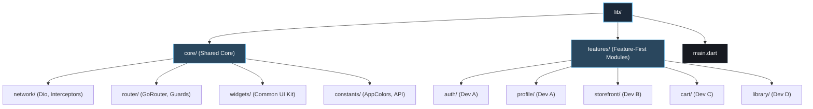
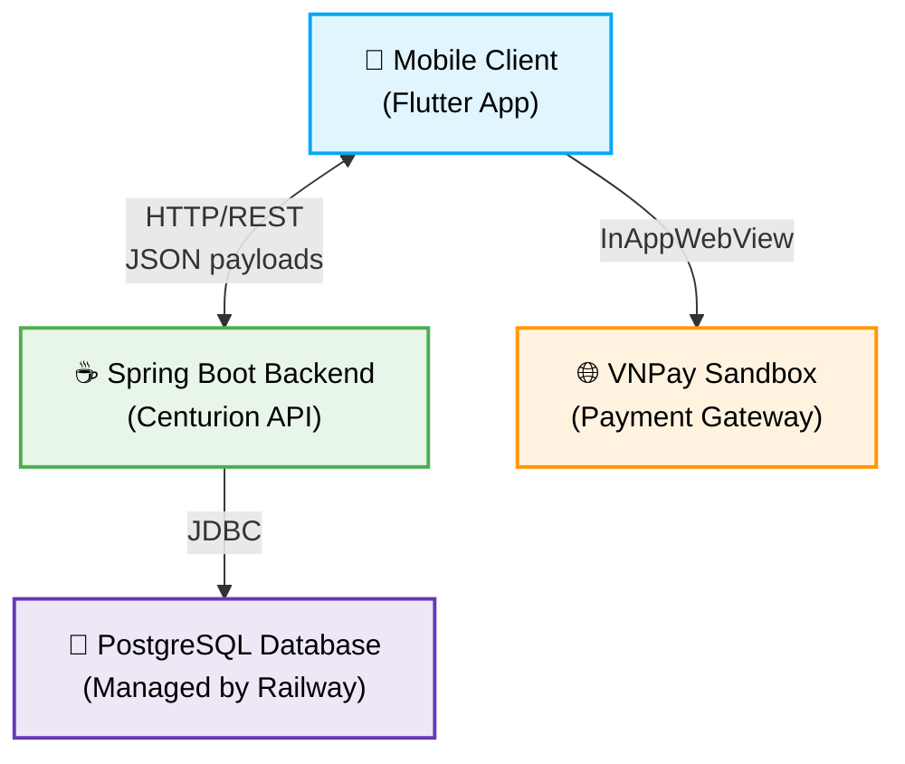
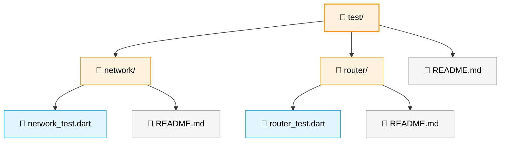

# Danh Sách Sơ Đồ Hệ Thống

## package_diagram

```mermaid
graph TD
    lib["lib/"] --> core["core/ (Shared Core)"]
    lib --> features["features/ (Feature-First Modules)"]
    lib --> main["main.dart"]

    core --> network["network/ (Dio, Interceptors)"]
    core --> router["router/ (GoRouter, Guards)"]
    core --> widgets["widgets/ (Common UI Kit)"]
    core --> constants["constants/ (AppColors, API)"]

    features --> auth["auth/ (Dev A)"]
    features --> profile["profile/ (Dev A)"]
    features --> storefront["storefront/ (Dev B)"]
    features --> cart["cart/ (Dev C)"]
    features --> library["library/ (Dev D)"]

    style lib fill:#1b2838,stroke:#66c0f4,stroke-width:2px,color:#fff
    style core fill:#2a475e,stroke:#66c0f4,stroke-width:1px,color:#fff
    style features fill:#2a475e,stroke:#66c0f4,stroke-width:1px,color:#fff
    style main fill:#171a21,stroke:#c7d5e0,stroke-width:1px,color:#fff
```

## system_architecture

```mermaid
graph TD
    %% Định nghĩa các nút chính
    A["📱 Mobile Client<br>(Flutter App)"]
    B["☕ Spring Boot Backend<br>(Centurion API)"]
    C["🌐 VNPay Sandbox<br>(Payment Gateway)"]
    D["🐘 PostgreSQL Database<br>(Managed by Railway)"]

    %% Thiết lập các kết nối kết hợp nhãn mô tả (Đã sửa <=> thành --> và <-->)
    A <-->|HTTP/REST<br>JSON payloads| B
    A -->|InAppWebView| C
    B -->|JDBC| D

    %% Tùy chỉnh màu sắc hiển thị (Styles)
    classDef client fill:#e1f5fe,stroke:#03a9f4,stroke-width:2px,color:#000;
    classDef backend fill:#e8f5e9,stroke:#4caf50,stroke-width:2px,color:#000;
    classDef gateway fill:#fff3e0,stroke:#ff9800,stroke-width:2px,color:#000;
    classDef database fill:#ede7f6,stroke:#673ab7,stroke-width:2px,color:#000;

    class A client;
    class B backend;
    class C gateway;
    class D database;
```

## testcase_architecture

```mermaid
graph TD
    %% Định nghĩa cấu trúc cây thư mục
    root["📁 test/"]

    %% Tầng 1
    network["📁 network/"]
    router["📁 router/"]
    readme_root["📄 README.md"]

    %% Tầng 2 (Bên trong network/)
    net_test["📄 network_test.dart"]
    readme_net["📄 README.md"]

    %% Tầng 2 (Bên trong router/)
    rot_test["📄 router_test.dart"]
    readme_rot_dir["📄 README.md"]

    %% Thiết lập các kết nối phân cấp
    root --> network
    root --> router
    root --> readme_root

    network --> net_test
    network --> readme_net

    router --> rot_test
    router --> readme_rot_dir

    %% Tùy chỉnh phong cách giao diện (Màu sắc hiện đại)
    style root fill:#fff3e0,stroke:#ff9800,stroke-width:2px,color:#000
    style network fill:#fff3e0,stroke:#ff9800,stroke-width:1px,color:#000
    style router fill:#fff3e0,stroke:#ff9800,stroke-width:1px,color:#000
    style readme_root fill:#f5f5f5,stroke:#9e9e9e,stroke-width:1px,color:#000
    style net_test fill:#e1f5fe,stroke:#03a9f4,stroke-width:1px,color:#000
    style rot_test fill:#e1f5fe,stroke:#03a9f4,stroke-width:1px,color:#000
    style readme_net fill:#f5f5f5,stroke:#9e9e9e,stroke-width:1px,color:#000
    style readme_rot_dir fill:#f5f5f5,stroke:#9e9e9e,stroke-width:1px,color:#000
```
