# System Diagrams List

## package_diagram

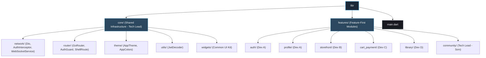

## system_architecture

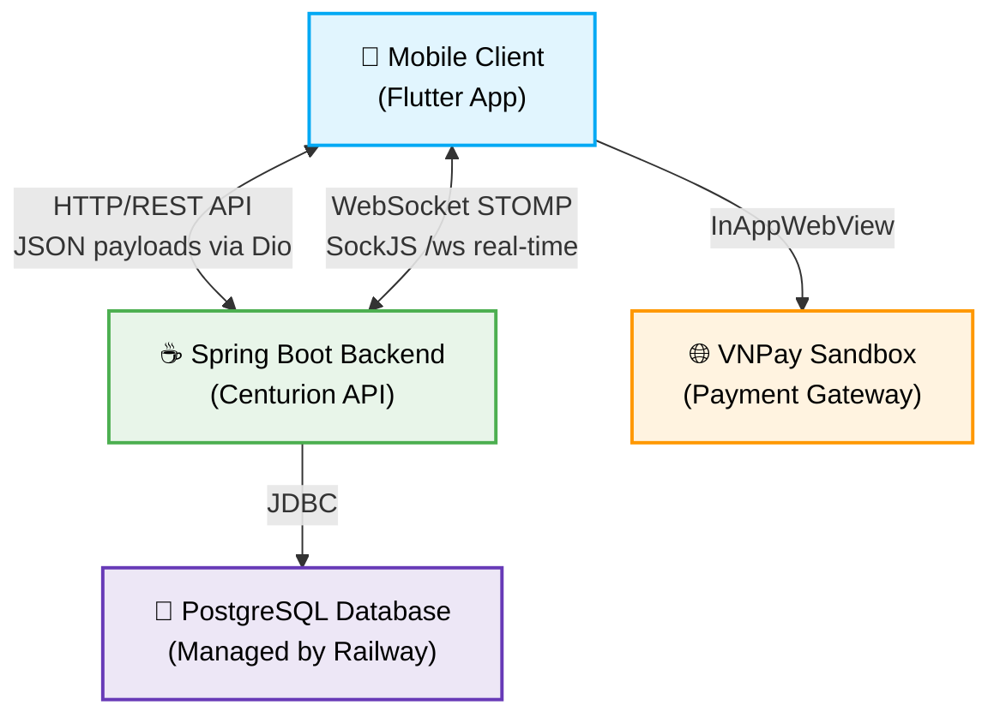

## testcase_architecture

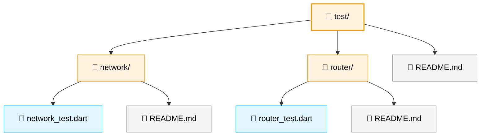

## database_schema

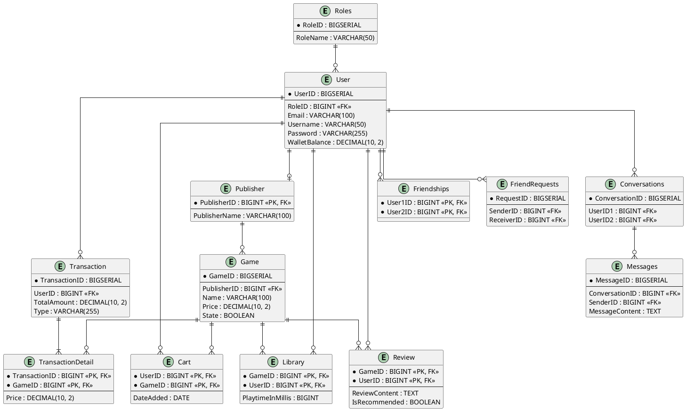

## screen_flows

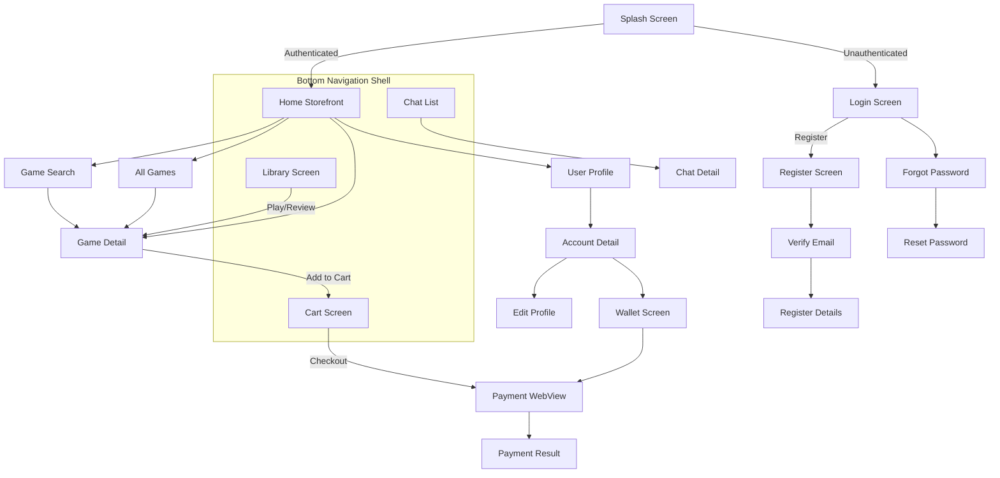

## actors

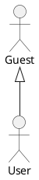

## guest_use_case

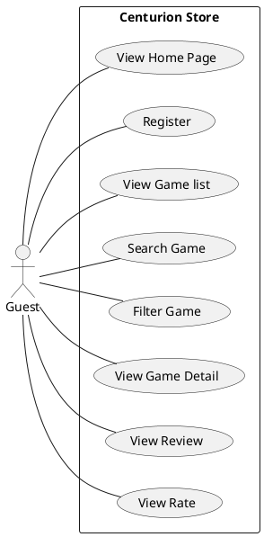

## user_use_case_1
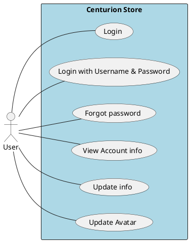

## user_use_case_2
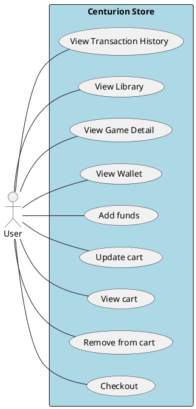

## user_use_case_3
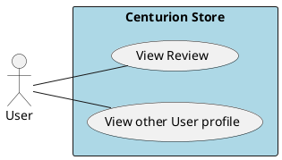

## user_use_case_4
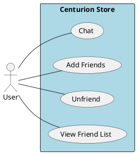

